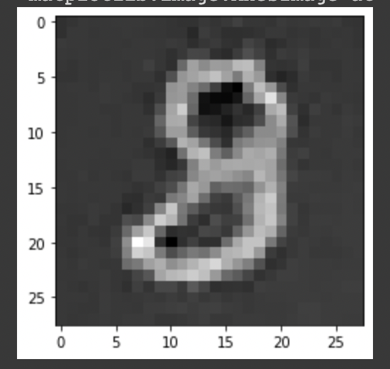
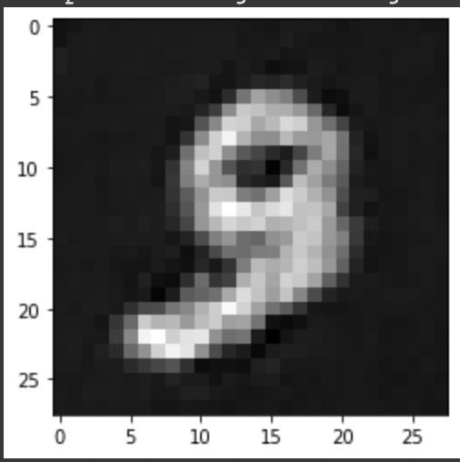
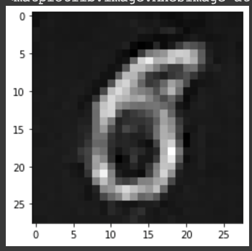

## Introduction

This project uses a Generative Adversarial Network (GAN) to generate images of hand-written digits from the MNIST dataset. The goal of the project is to explore the capabilities of GANs in generating realistic images.

## Dependencies

- TensorFlow 2.x
- Numpy
- Matplotlib
- Keras

## Dataset

The MNIST dataset consists of 60,000 training images and 10,000 testing images of hand-written digits (0-9). It is a widely used dataset for evaluating machine learning models. The dataset was downloaded from the official website (http://yann.lecun.com/exdb/mnist/).

## File structure

- Loading and Preprocessing dataset 
- Generator Network Architecture
- Discriminator Architecture 
- Custom Loss Function
- Custom Tranining Function using Tensorflow Gradient Tape
- Training Data 
- Sample output 

## Usage

To use the network architecture on a different dataset, replace the dataset, adjust the number of epochs. Create Tensorflow Batches and call the method `train(dataset, EPOCH)` with new dataset and custom number of EPOCHS. 

## Results

Here are some sample results from the GAN:

## Limitations

One limitation of the current model is that it is only able to generate images of a single digit class (e.g. only "3"s or only "8"s). It would be interesting to explore the possibility of generating images of multiple digit classes in a single run.

Another limitation is that the model is only able to generate images of a specific size and resolution. It would be interesting to see how the model performs on larger or higher resolution images.

## Future Work 

Future work

- There are several ways that the current model could be improved or extended in the future:

- Explore the use of different GAN architectures or training techniques to improve the quality of the generated images.

- Extend the model to generate images of multiple digit classes in a single run.

- Experiment with generating images of different sizes and resolutions.
Explore the use of the GAN for other types of image generation tasks.

## Credits

- The GAN model in this project is based on the TensorFlow tutorial "Introduction to GANs" (https://www.tensorflow.org/tutorials/generative_adversarial_network). 
